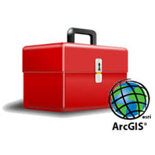

# FMG-toolbox

The Forest Management Geodatabase (FMG), FMG toolbox provides a set of python-based ESRI ArcGIS Toolbox tools that allow users to accomplish the following:
- Quality control and assure field collected prism, fixed, and age plot surveys
- Calculate a wide range of forest statistics at multiple spatial resolutions
- Generate reports and spatial views of the statistics

## Project Status

## Description

The FMG toolbox is an ESRI ArcGIS Python toolbox used to process FMG forestry field surveys into a geodatabase and produce summary reports. The FMG toolbox was developed by USACE foresters and geographers to implement the forest monitoring protocols established by the [Upper Mississippi River Systemic Forest Stewardship Plan](https://www.mvd.usace.army.mil/Portals/52/docs/regional_flood_risk_management/our_mississippi/UMRSystemicFSP7-26-12.pdf), [Executive Summary](https://www.mvd.usace.army.mil/Portals/52/docs/regional_flood_risk_management/our_mississippi/UMR/UMR%20Systemic%20FSP%20-%20Exec%20Summary%20Aug%202012.pdf).  

***

## Funding
Funding for development and maintenance of the FMG-toolbox has been provided by the following US Army Corps of Engineers (USACE) programs:

* [St. Paul District, Mississippi River Project](https://www.mvp.usace.army.mil/Missions/Recreation/)
* [Rock Island District, Mississippi River Project](https://www.mvr.usace.army.mil/Missions/Recreation/Mississippi-River-Project/)
* [St. Louis District, Rivers Project Office](https://www.mvs.usace.army.mil/Missions/Recreation/Rivers-Project-Office/)
* [Navigation and Ecosystem Sustainability Program (NESP)](https://www.mvr.usace.army.mil/Rock-Island-District/Programs/NESP/)
* [Upper Mississippi River Restoration Program (UMRR)](https://www.mvr.usace.army.mil/Missions/Environmental-Stewardship/Upper-Mississippi-River-Restoration/)

***

## Latest Updates
Check out the [NEWS](NEWS.md) for details on the latest updates.  

***  

## Authors
* [Christopher Hawes](mailto:Christopher.C.Hawes@usace.army.mil), Geographer, Rock Island District, U.S. Army Corps of Engineers
* [Alden Ross](mailto:alden.g.ross@usace.army.mil), Geographer, Rock Island District, U.S. Army Corps of Engineers
* [Michael Dougherty](mailto:Michael.P.Dougherty@usace.army.mil), Geographer, Rock Island District, U.S. Army Corps of Engineers 
<a itemprop="sameAs" content="https://orcid.org/0000-0002-1465-5927" href="https://orcid.org/0000-0002-1465-5927" target="orcid.widget" rel="me noopener noreferrer" style="vertical-align:top;">https://orcid.org/0000-0002-1465-5927</a>

* [Andy Meier](Andrew.R.Meier@usace.army.mil), Forester, St. Paul District, U.S. Army Corps of Engineers
* [Ben Vandermyde](mailto:Benjamin.J.Vandermyde@usace.army.mil), Forester, Rock Island District, U.S. Army Corps of Engineers
* [Brian Stoff](Brian.W.Stoff@usace.army.mil), Forester, St. Louis District, U.S. Army Corps of Engineers

## Bug Reports
If you find any bugs while using the FMG toolbox toolbox, please open an [issue](https://github.com/ForestManagementGeodatabase/FMG-toolbox/issues) in this repository. 

*** 

## Configure PyCharm (Devs)
1. Set Python Interpreter - Go to File | Setings | Project <Project Name> | Python Interpreter. Configure the source to the ArcGIS Pro python interpreter installed alongside your Pro install. Generally at this path: "C:\Program Files\ArcGIS\Pro\bin\Python\envs\arcgispro-py3\python.exe"
2. Set Python Terminal - Go to File | Settings | Tools | Terminal. Set the shell path to C:\Program Files\ArcGIS\Pro\bin\Python\Scripts\proenv.bat.
3. Set Python Console - Go to File | Settings | Build, Execution, Deployment | Console. Uncheck the radio button next to 'Use IPython if available'. Note this changes the console to a more IDLE like experience, to continue using the console in a python-notebook like experience, ignore this step.

